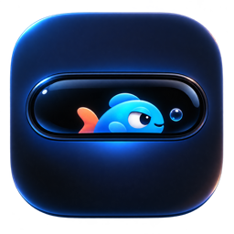
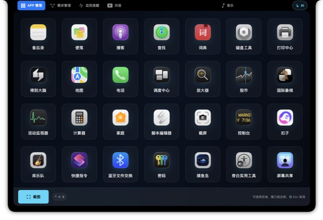
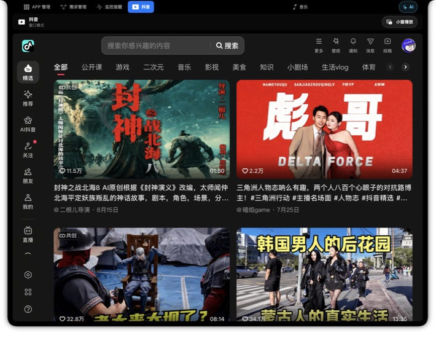
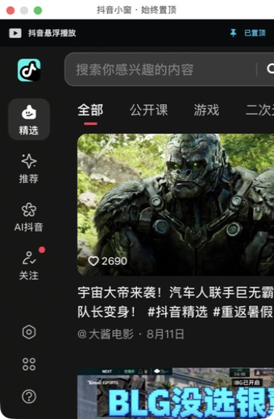
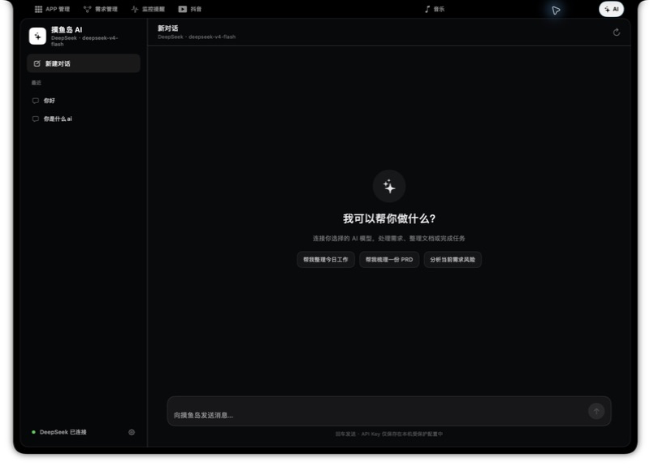

# 摸鱼岛

<p align="center">
  
</p>

<p align="center">
  <b>贴在 Mac 顶部的桌面工作台：启动 App、刷抖音小窗、调用 AI Agent、管理需求与截图。</b>
</p>

<p align="center">
  
  
  
</p>

> 摸鱼岛目前处于个人开发与体验阶段，功能和界面仍会持续调整。欢迎 Star、Fork、提交 Issue。

## 功能预览

### APP 管理

默认展示本机已安装的应用。双击直接启动，长按可隐藏，无需进入额外详情页。



### 抖音与置顶小窗

在主面板内使用桌面版抖音，保留搜索、分类和滚轮/触控板浏览；可切换为可移动的独立小窗，并默认保持置顶。关闭主面板或悬浮小窗时会暂停其中的视频和音频，避免后台继续播放。





### AI Agent 工作台

内置接近 Codex 操作习惯的会话界面，支持历史会话、流式回答和快捷任务。当前支持：

- Dify Agent
- DeepSeek
- OpenAI
- OpenAI 兼容服务（自定义 Base URL 与模型名）

API Key 仅保存在本机运行目录的私有配置文件中，不写入源码，也不应提交到 GitHub。



### 需求管理

创建需求时自动建立独立文件夹和完整阶段目录：

```text
需求 PRD → 原型文档 → 测试验收 → 上线
```

上传文件会复制到当前需求对应的阶段文件夹中，并可按阶段推进、打开文件和确认上线。

### 截图、监控与音乐

- 截图支持区域、窗口和全屏模式，全局快捷键为 `Control + Shift + S`。
- 截图结果可固定置顶，方便设计对照和资料摘录。
- 监控提醒用于集中查看提醒和系统状态。
- 音乐入口在主面板中加载 Apple Music 网页版。

## 顶部导航

```text
APP 管理 → 需求管理 → 监控提醒 → 抖音 → 音乐                    AI
```

界面会针对带物理摄像头刘海的 Mac 调整导航位置，避免按钮被摄像头区域遮挡。点击面板外部区域即可收起。

## 环境要求

- macOS 14 或更高版本
- Xcode（用于从源码构建）
- Apple Silicon 或 Intel Mac

抖音、Apple Music、Dify 和其他 AI 模型服务需要网络连接；相关账户和 API 调用费用由对应服务提供方决定。

## 从源码运行

```bash
git clone https://github.com/maomengen888-maker/trae-flow.git
cd trae-flow
open TraeFlow.xcodeproj
```

在 Xcode 中选择 `TraeFlow` Scheme 和 `My Mac`，然后点击 Run。构建后的应用名称为 `摸鱼岛.app`，Bundle ID 为 `ai.dynamic.app`。

也可以使用命令行构建：

```bash
xcodebuild \
  -project TraeFlow.xcodeproj \
  -scheme TraeFlow \
  -configuration Debug \
  CODE_SIGNING_ALLOWED=NO \
  build
```

首次使用截图、打开其他应用或系统集成功能时，macOS 可能请求相应权限，请根据实际需要授权。

## 安全说明

- 不要把 API Key 写进源码、截图、Issue 或提交记录。
- `Config/LocalSecrets.xcconfig` 和本地构建目录已加入 `.gitignore`。
- AI 凭据使用本机运行目录中的权限受限文件保存，以避免每次打开 AI 都弹出钥匙串授权；这比系统钥匙串保护更弱，请只在个人可信设备上使用。
- 项目内嵌网页来自第三方服务，登录、内容和可用性受对应网站规则影响。

## 项目背景与致谢

摸鱼岛基于 [ccsonicc333/trae-flow](https://github.com/ccsonicc333/trae-flow) 继续设计和开发。原项目专注于 TRAE 任务状态、Mac 灵动岛和自定义区域；本版本将产品方向扩展为桌面 App 入口、抖音小窗、AI Agent 与需求管理。

感谢原项目作者和所有开源贡献者。历史上的 `TraeFlow`、`Dynamic` 类型名与目录名为兼容原项目数据和结构而保留。

## 参与项目

欢迎通过 Issue 提交：

- Bug 与兼容性问题
- 新功能建议
- UI/交互优化
- AI 服务适配
- 文档与测试改进

如果你的 Mac 顶部也有一座岛，你最想把什么放上去？

## License

[Apache License 2.0](LICENSE.md)
